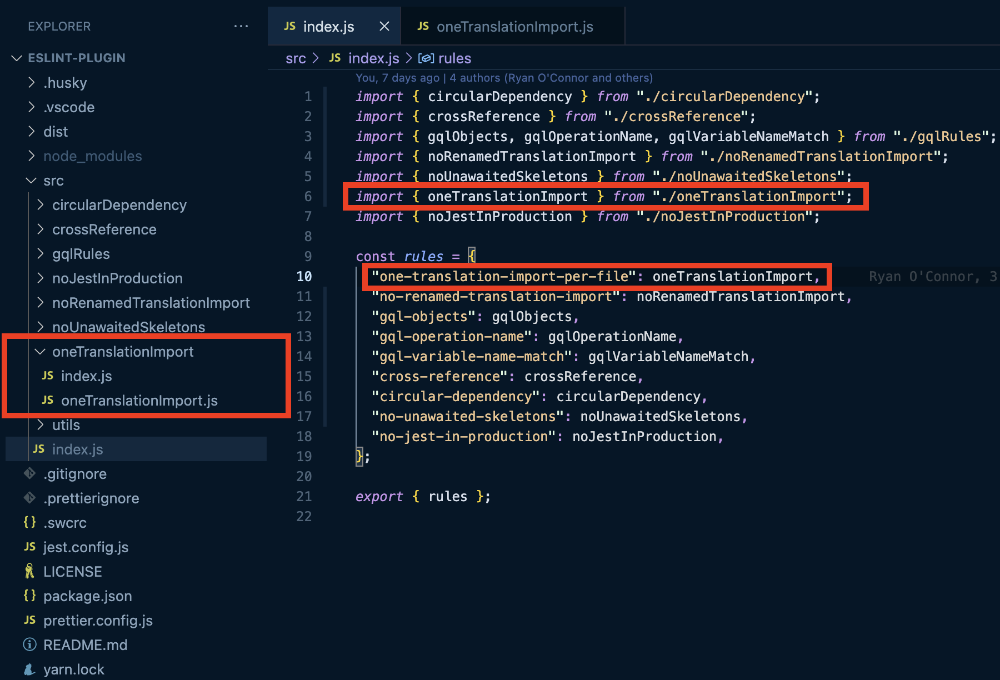
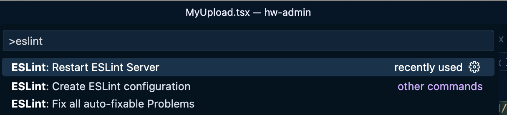
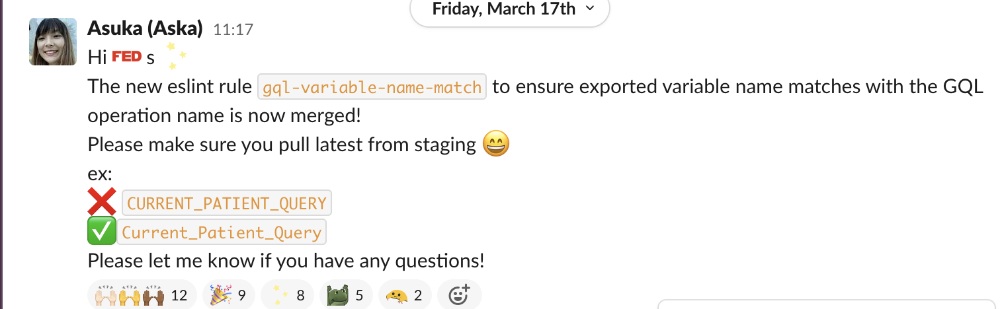
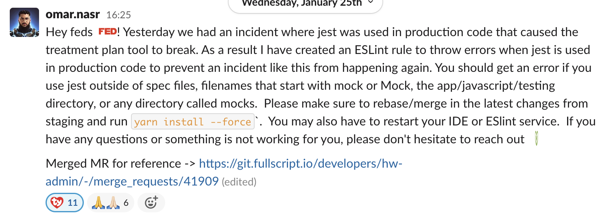
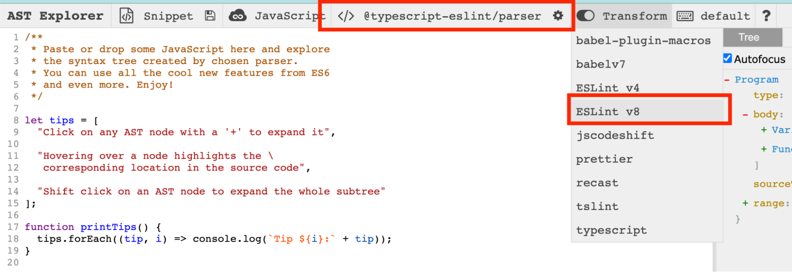

# eslint-plugin
Fullscript eslint rules

## How to create a custom ESLint rule

At Fullscript, we have a [public GitHub repo](https://github.com/Fullscript/eslint-plugin) that contains custom rules to cover the use cases specific to our app.
You can create custom rules to use with ESLint, if the core rules do not cover your use case and if there is not an existing open source plugin that can be used (e.g. [@shopify/eslint-plugin](https://github.com/Shopify/web-configs/tree/main/packages/eslint-plugin)).

To write custom ESLint rules, you will need to:
- Add a custom rule in the ESLint module
- Enable the rule in the ESLint configuration in your hw-admin repo

### Set up steps
1. Fork [Fullscript/eslint-plugin](https://github.com/Fullscript/eslint-plugin) & clone your forked repo 
If this is your first time contributing to open-source projects, refer to [this article](https://dev.to/codesphere/how-to-start-contributing-to-open-source-projects-on-github-534n)
2. In the cloned ESLint-plugin repo
    - Run `yarn build-watch` to generate the dist folder 
    You could also run `yarn build` if you only want to run once instead of re-building automatically as you make changes
    - Run `yarn link` 
    This will create a symlink to the local package that allows you to use your local version to debug a problem
3. In your hw-admin repo
    - Run `yarn link @fullscript/eslint-plugin` 
This will link the package to your current project and allows you to use the local version of the package you previously linked
    - To remove the linked package, run `yarn unlink @fullscript/eslint-plugin` and `yarn install –force`

1. In the local ESLint-plugin repo, create a new rule like so
    - Create a new folder for the rule under `./src`
    - Add a file that contains the new rule (e.g. `/oneTranslationImport.js`) and an index file that exports it  (e.g. `/oneTranslationImport/index.js`)
    - Add your new rule in `rules` in `src/index.js` to be exported as a new rule
    
2. In your hw-admin repo, add the rule in a config file (e.g. `.eslintrc.loose.js`)
3. Run `yarn eslint {path to the file}` or you can also run to test more specific rule by `yarn eslint —c .eslintrc.loose.js {file name}` 
    Restart the ESLint server on VS Code for the new rule to be picked up 
    You can do so by pressing Cmd + Shift + P and type `eslint`

    

Now you’re ready to develop, happy coding!

### Once the PR is approved:
1. Reach out to the maintainer (post in the #hopper channel on slack) to bump the version and create a new release
2. Once the new release is ready, create an MR in In your hw-admin repo to apply the new ESLint rule ([example MR](https://git.fullscript.io/developers/hw-admin/-/merge_requests/43442))
3. Once it’s merged, announce in the #feds channel that the new rule is applied!

    
    

### Tips:
ESLint uses Abstract Syntax Trees (AST). AST is a tree representation of the source code that tells us about the code structure. Tools like ESLint create AST for a given piece of code and execute rules on it. To figure out specific instructions for our custom rule, we need to inspect AST manually.

AST Explorer allows you to play around with it
https://astexplorer.net

*Select @typescript-eslint/parser and ESLint v8 as the transform to use AST Explorer in ESLint environment

  

### Useful resources:
ESLint official doc
https://eslint.org/docs/latest/extend/custom-rules

How to write custom ESLint rules
https://developers.mews.com/how-to-write-custom-eslint-rules/

How to write a custom ESLint rule
https://blog.scottlogic.com/2021/09/06/how-to-write-an-es-lint-rule-for-beginners.html

Video where Ryan explains AST Explorer
https://drive.google.com/file/d/1oQ3nnYVeDA7Dcs0RIzgZamYreFAbMS33/view

